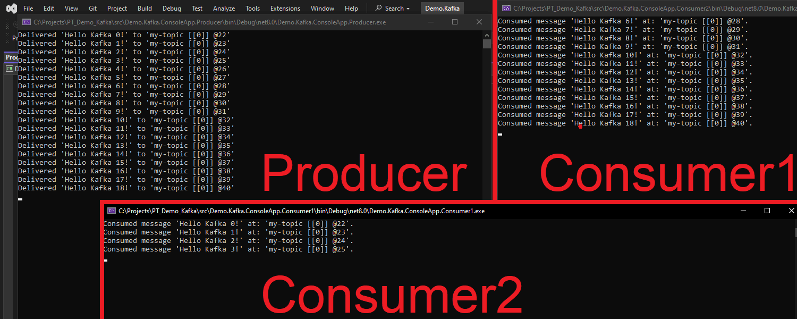
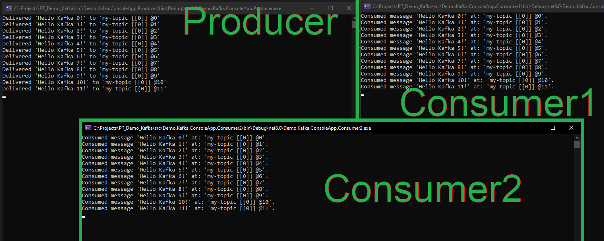

# PT_Demo_Kafka

## Contents

- [AWS SQS Queue / Apache Kafka / Rabbit MQ](#aws-sqs-queue-vs-apache-kafka-vs-rabbit-mq)
  - [AWS SQS](#aws-sqs-simple-queue-service)
  - [Kafka](#kafka)
  - [RabbitMQ](#rabbitmq)
  - [Comparison](#comparison)
- [Demos](#demos)
  - [Prerequisites](#prerequisites)
  - [Demo Kafka 2 Consumers 1 Producer](#demo-kafka-2-consumers-1-producer)
  - [Demo Kafka UI](#demo-kafka-ui)
- [Publish and Receive Messages](#publish-and-receive-messages)
  - [Using Terminal](#using-terminal)
  - [Using Python](#using-python)
- [Links](#links)

## AWS SQS Queue vs. Apache Kafka vs. Rabbit MQ

### AWS SQS (Simple Queue Service)
AWS SQS is a fully managed message queuing service by Amazon Web Services.  
It enables decoupling and scaling of microservices, distributed systems, and serverless applications.

### Kafka
Apache Kafka is an open-source stream-processing platform developed by LinkedIn and maintained by the Apache Software Foundation.  
Designed for high-throughput, low-latency, real-time data feeds.

### RabbitMQ
RabbitMQ is an open-source message broker software that implements the Advanced Message Queuing Protocol (AMQP).  
Known for its robustness and flexibility.

### Comparison


|Feature      |AWS SQS                                 |Kafka                                           |RabbitMQ                                     |
|-------------|----------------------------------------|------------------------------------------------|---------------------------------------------|
|Management   |Fully managed	                         |Self-managed or Confluent Cloud	                |Self-managed or managed services             |
|Message Order|FIFO (optional)                         |Ordered within partitions                       |Supports ordered messages with queues        |
|Scalability  |Auto-scaling	                           |Highly scalable with partitions	                |Scalable, but requires manual setup          |
|Throughput   |High (depends on queue type)	           |Very high (millions of messages / sec)	        |Moderate to high                             |
|Latency      |Low to moderate                       	 |Low                                             |Low                                          |
|Persistence  |Short-term message storage	             |Long-term message storage (configurable)	      |Persistent storage with manual configuration |
|Use Case Fit	|Simple queuing, microservice decoupling |Real-time streaming, large-scale data pipelines	|Complex routing, real-time communication     |
|Integration  |Deep integration with AWS ecosystem	   |Integrates with many systems via connectors	    |Integrates well with various protocols       |
|Support      |Strong AWS support	                     |Large open-source community	                    |Large open-source community                  |
|Ease of Use	|Easy to use and setup	                 |Requires more setup and maintenance	            |Moderate setup complexity                    |

## Demos

### Prerequisites

1. Run `Kafka` and its dependency `Zookeeper` locally in Docker containers using the following `docker-compose.yml` file:

```
version: '3.8'
services:
  # Apache ZooKeeper is an open-source server for highly reliable distributed coordination of cloud applications. Zookeeper is a project of the Apache Software Foundation.
  zookeeper:
    image: confluentinc/cp-zookeeper:7.3.0
    environment:
      ZOOKEEPER_CLIENT_PORT: 2181
      ZOOKEEPER_TICK_TIME: 2000

  kafka:
    image: confluentinc/cp-kafka:7.3.0
    depends_on:
      - zookeeper
    ports:
      - "9092:9092"
    environment:
      KAFKA_BROKER_ID: 1
      KAFKA_ZOOKEEPER_CONNECT: zookeeper:2181
      KAFKA_ADVERTISED_LISTENERS: PLAINTEXT://localhost:9092
      KAFKA_LISTENERS: PLAINTEXT://0.0.0.0:9092
      KAFKA_OFFSETS_TOPIC_REPLICATION_FACTOR: 1
```

2. Next, run the containers:

```
docker-compose up -d
```

💡 SUGGESTION: In case you need to use UI for Kafka, see section [Demo Kafka UI](#demo-kafka-ui).

### Demo Kafka 2 Consumers 1 Producer

1. Create a blank Solution `Demo.Kafka` including the following .NET 8 Console Applications:
- Demo.Kafka.ConsoleApp.Producer
- Demo.Kafka.ConsoleApp.Consumer1
- Demo.Kafka.ConsoleApp.Consumer2

2. Install `Confluent.Kafka (2.4.0)` NuGet package in all 3 console applications.

3. In `Demo.Kafka.ConsoleApp.Producer`, add the code that you will find in the repo.

4. In `Demo.Kafka.ConsoleApp.Consumer1` and `Demo.Kafka.ConsoleApp.Consumer2`, add the code that you will find in the repo.

💡 SUGGESTION: Pay attention to the `ConsumerConfig`:

```
        var config = new ConsumerConfig
        {
            GroupId = "group-consumer-abc",
            BootstrapServers = "localhost:9092",
            AutoOffsetReset = AutoOffsetReset.Earliest
        };
```

In case both `Consumer` applications have the same `GroupId`, the messages published by the `Producer` will only be consumed by any of the `Consumers` in group `group-consumer-abc`:



In case the 2 Consumers have`ConsumerConfig` with different `GroupId`-s (meaning they belong to different groups) all the messages will be read by all the consumers:



5. Run the `Producer` and the 2 `Consumer`-s and check the results when `Producer` starts publishing messages...

### Demo Kafka UI

1. Edit `docker-compose.yml` and declare `Kafka Manager` Docker container, then rerun:

```
version: '3.8'
services:
  zookeeper:
    image: confluentinc/cp-zookeeper:7.3.0
    environment:
      ZOOKEEPER_CLIENT_PORT: 2181
      ZOOKEEPER_TICK_TIME: 2000

  kafka:
    image: confluentinc/cp-kafka:7.3.0
    depends_on:
      - zookeeper
    ports:
      - "9092:9092"
    environment:
      KAFKA_BROKER_ID: 1
      KAFKA_ZOOKEEPER_CONNECT: zookeeper:2181
      KAFKA_ADVERTISED_LISTENERS: PLAINTEXT://localhost:9092
      KAFKA_LISTENERS: PLAINTEXT://0.0.0.0:9092
      KAFKA_OFFSETS_TOPIC_REPLICATION_FACTOR: 1

  kafkamanager:
    image: hlebalbau/kafka-manager:stable
    ports:
      - "9000:9000"
    environment:
      ZK_HOSTS: zookeeper:2181
    depends_on:
      - zookeeper
      - kafka
```

2. Access `Kafka Manager` on http://localhost:9000.

3. Go to Menu > `Cluster` > `Add Cluster`
- Cluster Name: local
- Cluster Zookeeper Hosts: zookeeper:2181
- Kafka Version: 2.8.0 (or the version you're using)
- Enable JMX Polling: false
- [Save]

4. Check the metrics. In `Topics`, you will see 2 entities:
- my-list
- __consumer_offsets

`__consumer_offsets` topic in Apache Kafka is a special internal topic used by Kafka to store the offsets of messages for each consumer group. This topic is crucial for Kafka’s ability to track which messages have been consumed by which consumer in a consumer group.

### Publish and Receive Messages

#### Using Terminal

```
# Look for IMAGE confluentinc/cp-kafka:7.3.0 and NAME src-kafka-1 and get the CONTAINER ID:
docker ps

docker exec -it bf90a67beb2e bash

# Create topic
kafka-topics --create --topic test-topic --bootstrap-server localhost:9092 --partitions 1 --replication-factor 1

# Verify result
kafka-topics --list --bootstrap-server localhost:9092

# Execute in 1st terminal:
kafka-console-consumer --topic test-topic --bootstrap-server localhost:9092 --from-beginning

# Open 2nd terminal:
kafka-console-producer --topic test-topic --bootstrap-server localhost:9092
```

#### Using Python
1. Create `Consumer.py`
2. Create `Producer.py`
3. Run in parallel.

## Links

- https://kafka.apache.org/documentation/